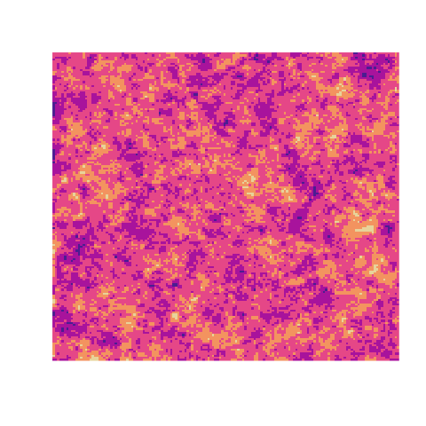
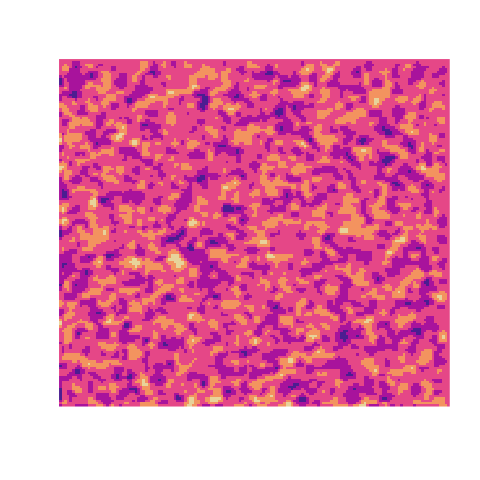
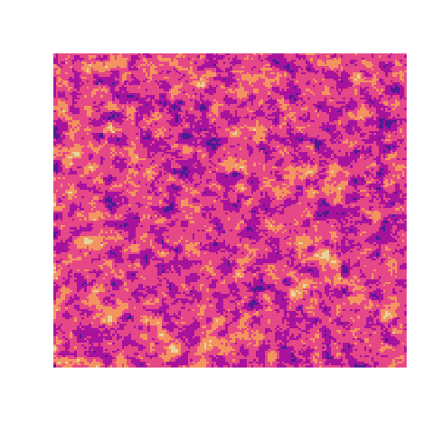

| Hi | Hi2 | Hi3 |
| --- | --- | --- |
|  |  |  |

 ## About Me
 - Training as a Numerical Analyst
 - Seeking a Master of Engineering degree in Applied Mathematics and Computer Science
 - Interested in the development of scientific libraries

 ## Projects

 ##### Current
 ***
 ### `libejovo++`
 A complete synthesis of the numeric methods and theoretical concepts learned while pursuing a masters. Written in C++20 with heavy utilisation of lambdas and adaptation to modern C++ practices (smart-pointers, concepts, template programming), this library concretizes the core concepts of my diploma. With a robust 2-dimensional Matrix library at its heart (with implementations of Matrix decompositions, direct and iterative methods, eigenvalue algorithms), this library provides numerous core modules needed invaluable for a scientific library:
 - discretization routines like `linspace` and `seq`
 - quadrature routines using both Newton-Cotes and Gaussian methods
 - polynomial interpolation
 - resolution of differential equations
 - RNG functions (using a xoroshiro shift-register generator) in the style of R's `runif`, `rexp`, `rbinom`
 - Monte Carlo integration routines
 - Markov Chain Monte Carlo methods implementing Metropolis, Metropolis-Hastings, and Gibbs-Sampling
 - Plotting interface that generates R `ggplot` code to visualize contour plots, scatter plots, and simple functions of a single variable.
 - First-order gradient methods, Second-order Newton/Quasi-Newton methods for optimization and machine learning.

This library implements industry standard practices using CMake as a build system, unit testing with CTest, and continuous integration using GitHub Actions. Heavily inspired by MATLAB, numpy, Julia, and R, this project is not an attempt to reinvent the wheel - it is a reenforcement of the fundamental aspects of Numerical Methods studied while at Sorbonne Université. After writing `libejovo`, this project has been an absolute breathe of fresh air and a great leap forward 20 years into the feature. Generic programming, standard containers, namespaces, operator overloading, support for functional programming paradigms, abstract base classes, and many more are language features that have helped me break free of C's structured constraints. Maximizing readibility and minimizing redundancy of code allows for simple instances of user-facing code like
```{C++}
auto x = ejovo::linspace(0, trig::two_pi);
ejovo::plot(x, x.map(cos));
```
Which generates the following `ggplot2` plot via a call to `Rscript`:


Or
```{C++}
auto f = [&] (double x) { return x * x; };
ejovo::integrate(f, 0, 3) // use 5 point Gauss-Legendre quadrature rule as default
```

### sousmarin
This group project is an exploration of Monte Carlo methods and how a deterministic computer generates pseudo-random numbers. Using R we create a `shiny` app that simulates samples taken from a multivariable guassian distribution to estimate the length of an underwater cable laid between two modern cities separated by a large body of water. I learned R's approach to the functional programming paradigm and also learned how to compile C++ code using the R package `Rcpp` to speed up mission-critical segments of code.
| col 1 | col 2 | -- |
|---- | --- | --- |
|  |  |  |

 ##### Past
 ***
 ### `libejovo`
 A watered down version of `libejovo++` that was written in C and naturally spawned from the code I was writing for our general C programming, DSA, and systems programming classes. There is also an implementation of a solid matrix library that taught me how to appreciate Fortran's simplistic `A(:,3) = B + 3` type indexing compared to a C function that would require a monstrosity like: `Matrix_set_col_mat(A, Matrix_add_scalar(B, 3))`. This syntax is implicitly implemented in modern languages like Python and C++ by operator overloading but in C simple indexing must be explicitly called via descriptive and namespaced functions prefixed with `Matrix_`.

 ### `viruses`
 A collection of MATLAB functions wrapped up in the `+ejovo` package that was written while a SIP student and Research Assistant under the advisement of Dr. David Wilson at Kalamazoo College, MI. This package contains the code that I wrote for my senior undergraduate thesis and an extension that permits the automatic fetching and downloading of viral capsids from the [VIPERdb](https://viperdb.scripps.edu/) to be instantiated as one of many user-defined virus classes in MATLAB. The software decomposed normal vibrational modes into icosahedrally symmetric versions of the Spherical Harmonics - which represent a symmetric analogue of a Discrete Fourier Series for functions in spherical coordinates.

| Linear Combination |  SAF6 |
| --- | --- |
|  |  |

 ### `Foreng`/`Formath`
 `Foreng` is a series of solutions to exercises for the book Fortran for [Scientists and Engineers](https://www.amazon.com/FORTRAN-SCIENTISTS-ENGINEERS-Stephen-Chapman/dp/0073385891) written to practice and learn the revered Fortran programming language. This project taught me how to write numeric programs in Fortran like calculating finite difference derivates, steady-state diffusion problems, computations of orbits, etc. There is even a chapter of exercices dedicated to using Coarrays and the OpenMP protocol. `Formath` is a continuation of my interest in Fortran and is a library written to practice modern fortran and fundamental linear algebra routines like Gaussian elimination, Gram-Schmidt orthogonalization, Householder Reflections, and many more.

<!---
ejovo13/ejovo13 is a ✨ special ✨ repository because its `README.md` (this file) appears on your GitHub profile.
You can click the Preview link to take a look at your changes.
--->
